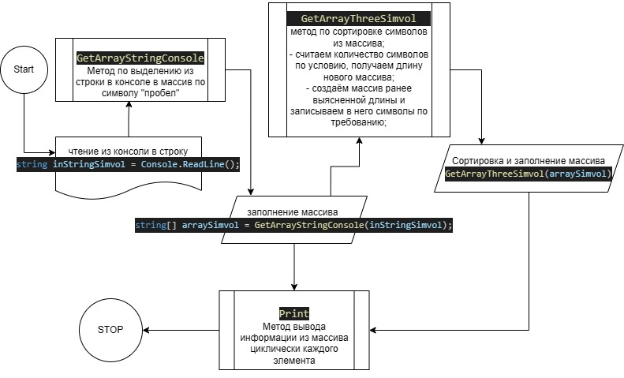

# K_R_Git_C
## Задача алгоритмически не самая сложная, однако для полноценного выполнения проверочной работы необходимо:

1. Создать репозиторий на [GitHub](https://github.com/VladimirNazgul/K_R_Git_C.git) 
2. Нарисовать блок-схему алгоритма (можно обойтись блок-схемой основной содержательной части, если вы выделяете её в отдельный метод)  
3. Снабдить репозиторий оформленным текстовым описанием решения (файл README.md)
4. Написать программу, решающую поставленную задачу
5. Использовать контроль версий в работе над этим небольшим проектом (не должно быть так, что всё залито одним коммитом, как минимум этапы 2, 3, и 4 должны быть расположены в разных коммитах)

## Задача : 
### Написать программу, которая из имеющегося массива строк формирует массив из строк, длина которых меньше либо равна 3 символа. Первоначальный массив можно ввести с клавиатуры, либо задать на старте выполнения алгоритма. При решение не рекомендуется пользоваться коллекциями, лучше обойтись исключительно массивами
### Примеры:

[“Hello”, “2”, “world”, “:-)”] → [“2”, “:-)”]  
[“1234”, “1567”, “-2”, “computer science”] → [“-2”]  
[“Russia”, “Denmark”, “Kazan”] → []  

## Описание алгоритма решения:
- Создание метода `GetArrayStringConsole`
>создаем метод для разделения строки из консоли в массив по знаку "пробел"
```C#
string[] GetArrayStringConsole (string inConsolSimvol)
{
    string[] arraySimvol = new string[inConsolSimvol.Length];
    arraySimvol = inConsolSimvol.Split(" ");
    return arraySimvol;
}
```
- Создание метода `GetArrayThreeSimvol`
>создаем метод сортирующий символы из массива.
сначала отсчитываем количество, удовлетворяющих требований, для определения длинны нового массива.
создаем массив по выясненому количествуи заносим туда символы удовлетворяющие требованиям.
```C#
string[] GetArrayThreeSimvol (string[] array)
{
    int count = 0;
    for (int i = 0; i < array.Length; i++)
    {
        string simvol = array[i];
        if (simvol.Length <= 3)
        {
            count++;
        }
    }
    string[] arrayThreeSimvol = new string[count];
    for (int i = 0, j = 0; i < array.Length; i++)
    {
        string simvol = array[i];
        if (simvol.Length <= 3)
        {
            arrayThreeSimvol[j] = simvol;
            j++;
        }
    }
    return arrayThreeSimvol;
}
```
- Создание метода `void Print`
>создаем метод для вывода информации из массива с использованием цеклического вывода каждого элемента.
```C#
void Print (string[] array)
{
    for (int i = 0; i < array.Length; i++)
    {
        Console.Write($"{array[i]}, ");
    }
    Console.WriteLine();
}
```
## Создаем вызов методов и обработки информации через консоль.
>выводим поясняющую информационную строку для пользователя в консоле: "Введите набор символов через пробел: "

  >- присваиваем введенное в консоле от пользователя символы `string inStringSimvol = console.ReadLine()`
  >- присваиваем массиву преобразованную строку через метод `string[] arraySimvol = GetArrayStringConsole(inStringSimvol)`
  >Console.WriteLine();
Console.Write("Введенные символы: ");
Print(GetArrayStringConsole(inStringSimvol));
Console.WriteLine();
Console.Write("Введенные символы длинной меньше либо равны 3: ");
Print(GetArrayThreeSimvol(arraySimvol));
Console.WriteLine();
```C#
Console.Write("Введите набор символов через пробел: ");
string inStringSimvol = Console.ReadLine();
string[] arraySimvol = GetArrayStringConsole(inStringSimvol);
Console.WriteLine();
Console.Write("Введенные символы: ");
Print(GetArrayStringConsole(inStringSimvol));
Console.WriteLine();
Console.Write("Введенные символы длинной меньше либо равны 3: ");
Print(GetArrayThreeSimvol(arraySimvol));
Console.WriteLine();
```
## **END**

